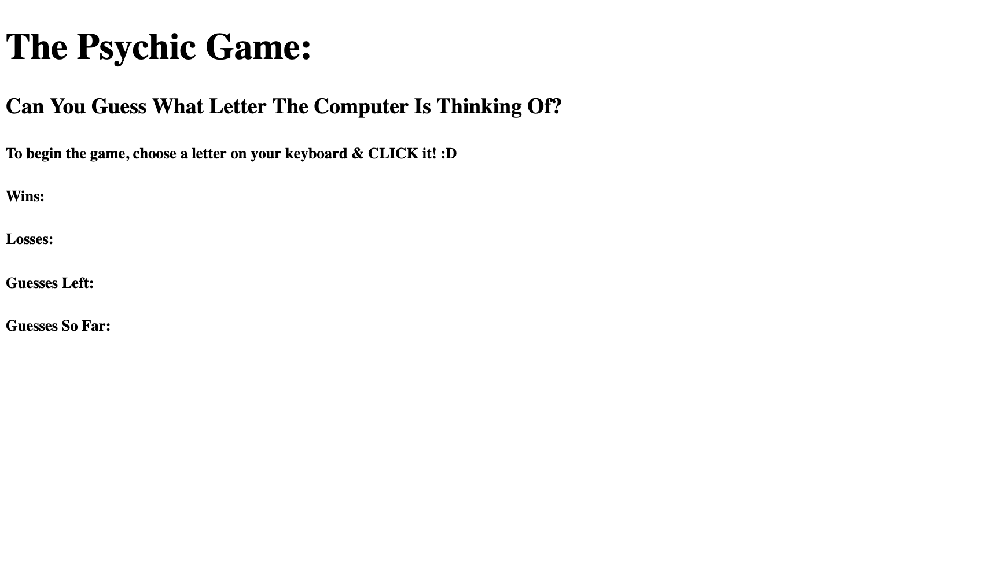
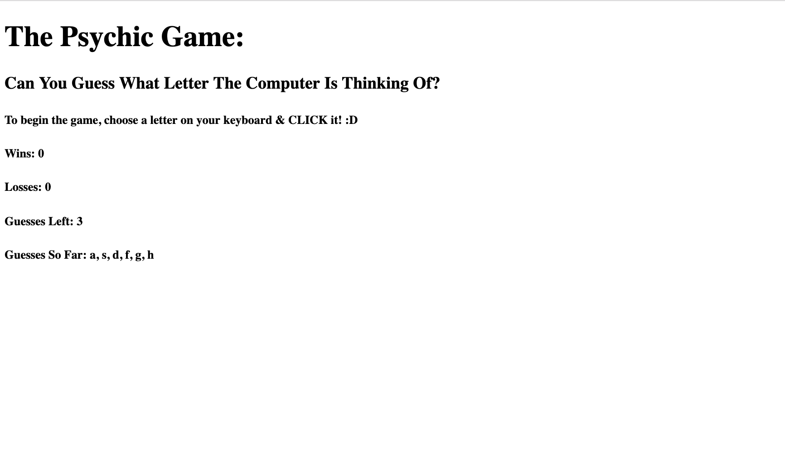

This is my submission for homework assignment number three. We were tasked with creating a game in which the user must guess which letter the computer is "thinking" of. In order to accomplish this, we had to use our recent understanding of JavaScript; specifically if/else statements, variables, functions, the and use of event listeners, etc. 

Tech I Used:

[HTML](https://www.w3schools.com/html/html_intro.asp)

[JavaScript](https://www.w3schools.com/html_css.asp)

Author: [Matthew Hagarty](https://github.com/matthewryanhagarty)